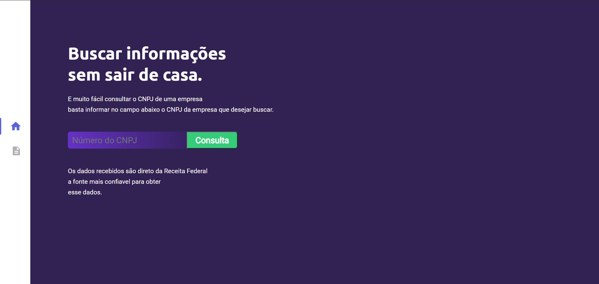
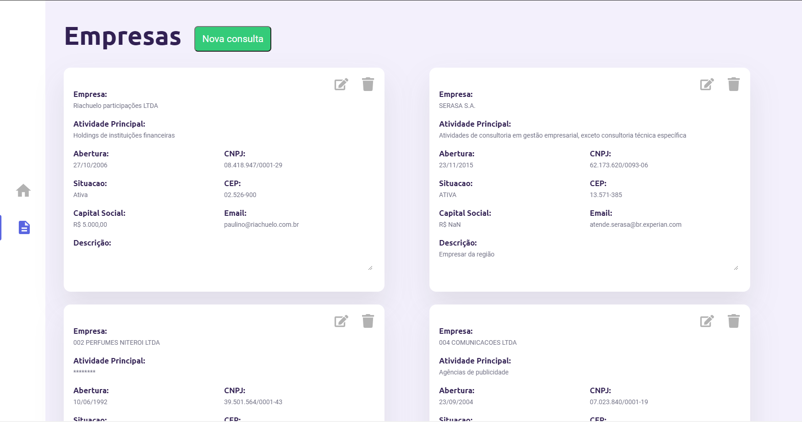

# Web consulta CNPJ


<p style="display: grid;grid-template-columns: 24.8rem 1fr;">
    
    
</p>

### 
### Sobre o projeto

O sistema desenvolvido utilizando API da Receita Federal em conjunto com a dependência `json-server`, onde recupero informações da Receita Federal através de uma consulta utilizando o CNPJ de uma empresar, posteriormente adiciono os dados recebidos em um arquivo `db.json` o qual será utilizado pelo `json-server` para fazer as operações de um CRUD(create, read, update and delete).

### Tecnologias usadas

React with typerscript

Api Restful

### Protótipo do projeto

[Figma: web-projeto](https://www.figma.com/file/p793aVTBmTyU0N3eW4GQiz/web-projeto?node-id=0%3A1)

### GitHub

[GitHub - erikbernard/app-web-consulta-cnpj](https://github.com/erikbernard/app-web-consulta-cnpj)

### Executa o projeto

```jsx
//install
yarn install

//start o nosso fron-end 
yarn start

//start o nosso back-end fake
//port tem que ser diferente do front
npx json-server ./api/db.json -p 333
```